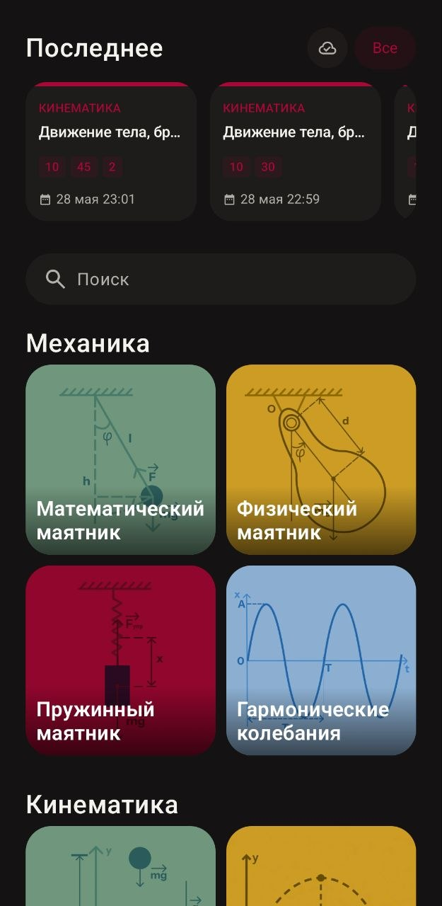
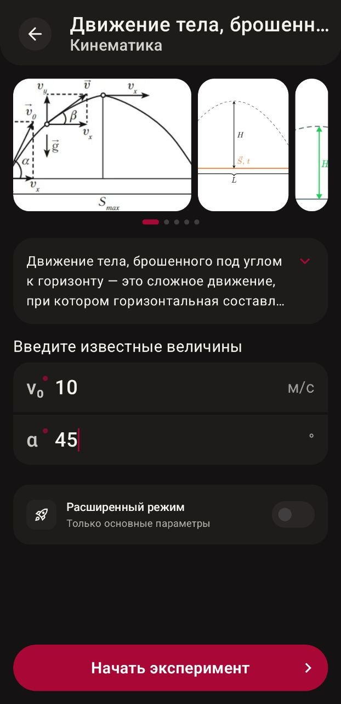
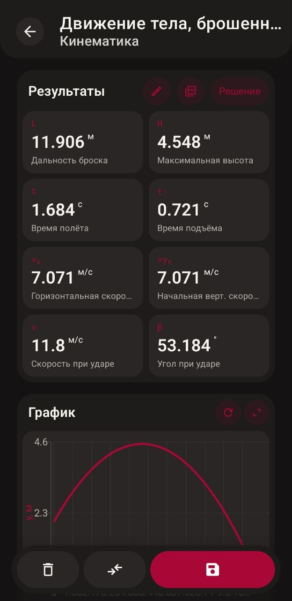
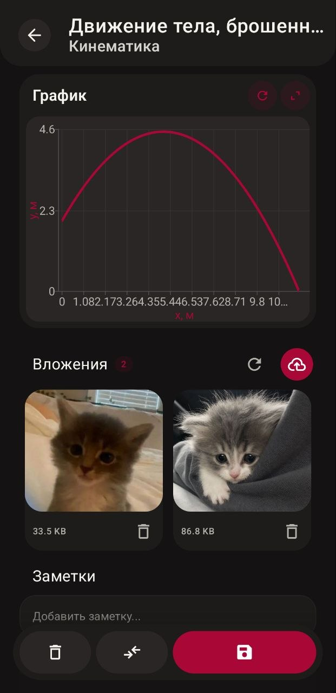
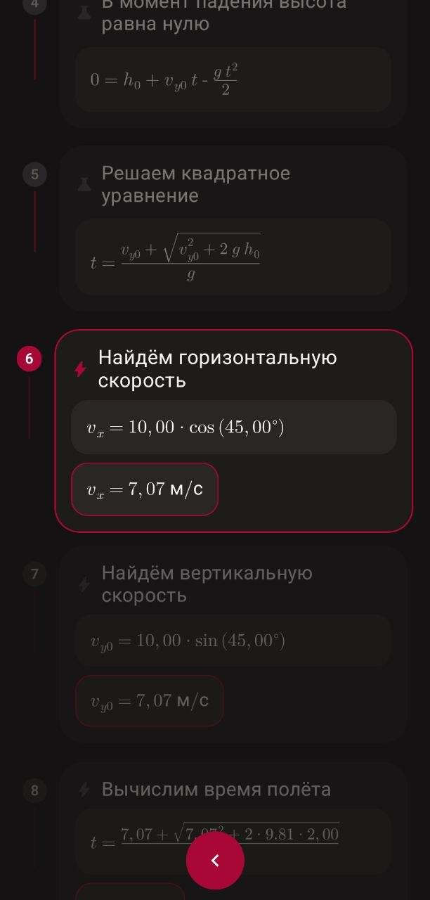
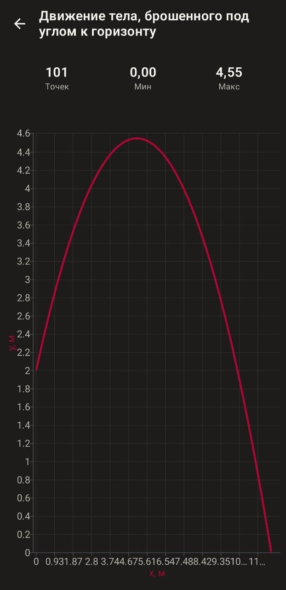
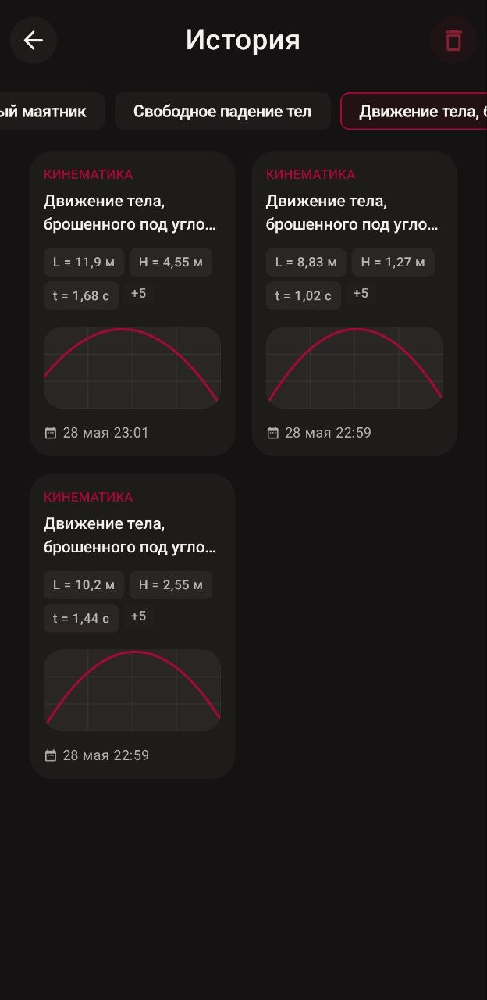
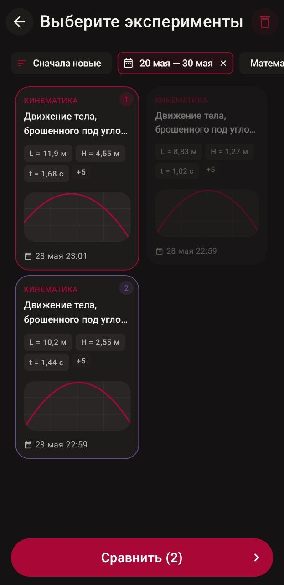
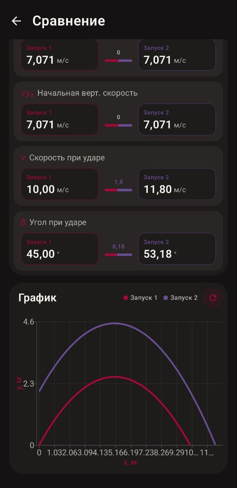

# PhysicsExps

### Android-приложение для расчета и изучения физических экспериментов.

## Возможности

- Каталог экспериментов с поиском и группировкой по категориям.

- Ввод параметров эксперимента и локальный расчет результатов.
  
- Экран результата с графиками, формулами и шагами решения.
  
- История запусков экспериментов (Room, локальная БД).
  
- Сравнение нескольких запусков по входным данным, результатам и графикам.
  
- Работа с медиа через backend API.
  
- Автоматическая регистрация устройства для авторизации в API.

## Скриншоты

<table>
  <tr>
    <td></td>
    <td></td>
    <td></td>
  </tr>
  <tr>
    <td></td>
    <td></td>
    <td></td>
  </tr>
  <tr>
    <td></td>
    <td></td>
    <td></td>
  </tr>
</table>

## Поддерживаемые эксперименты

В проекте реализованы:

- Свободное падение (`FreeFallExperiment`)
- Движение тела, брошенного под углом (`ProjectileMotionExperiment`)
- Маятник (математический) (`PendulumExperiment`)
- Физический маятник (`PhysicalPendulumExperiment`)
- Пружинный маятник (`SpringPendulumExperiment`)
- Гармонические колебания (`HarmonicVibrationsExperiment`)
- Закон Кулона (`CoulombsLawExperiment`)
- Закон Джоуля-Ленца (`JouleLenzExperiment`)
- Эффект Доплера (`DopplerEffectExperiment`)
- Радиоактивный распад (`RadioactiveDecayExperiment`)

## Технологии

- Kotlin, Coroutines, Flow
- Jetpack Compose + Material 3 Expressive
- Navigation 3
- Koin (DI)
- Room + KSP
- Retrofit + Kotlinx Serialization
- Coil
- Vico Charts
- Latex Renderer

## Архитектура

Проект разделен на слои:

- `presentation` - ui, экраны, ViewModel, навигация
- `domain` - модели, реестр экспериментов, use-case'ы, валидация
- `data` - repository-реализации, Room, remote API, mappers
- `di` - Koin-модули
